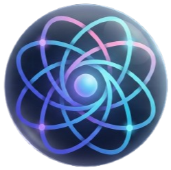
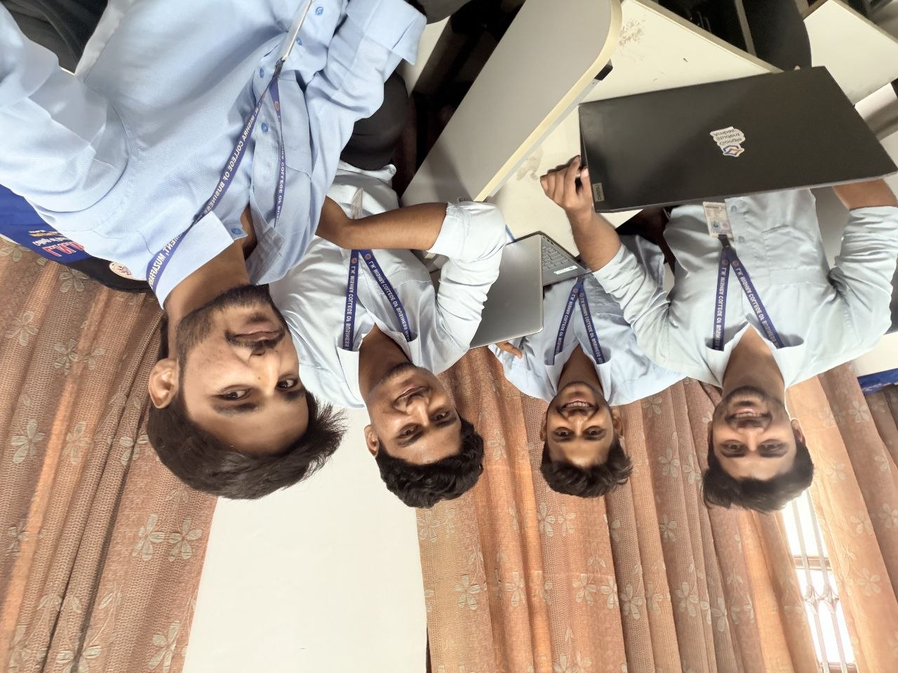
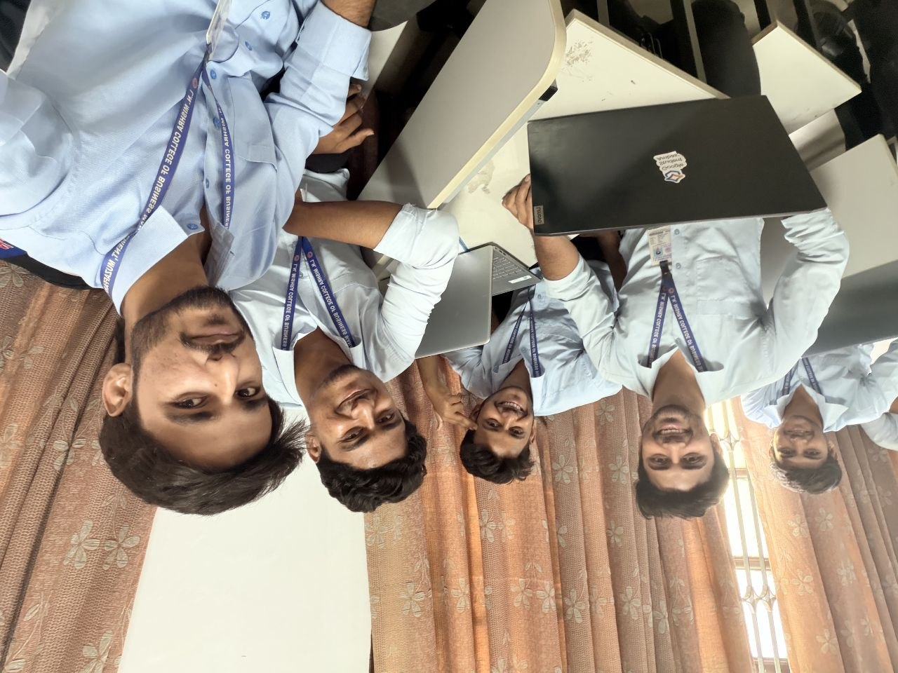
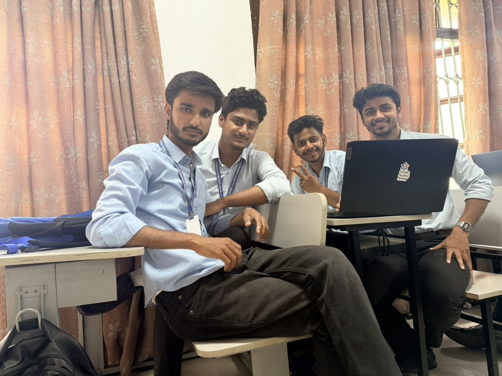
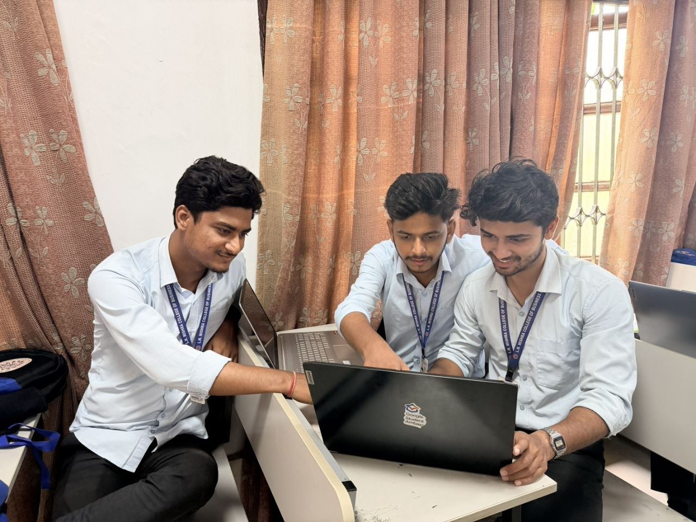
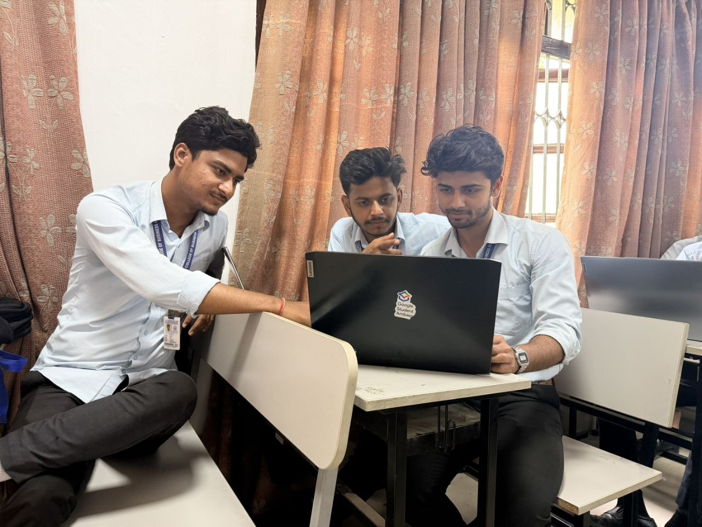
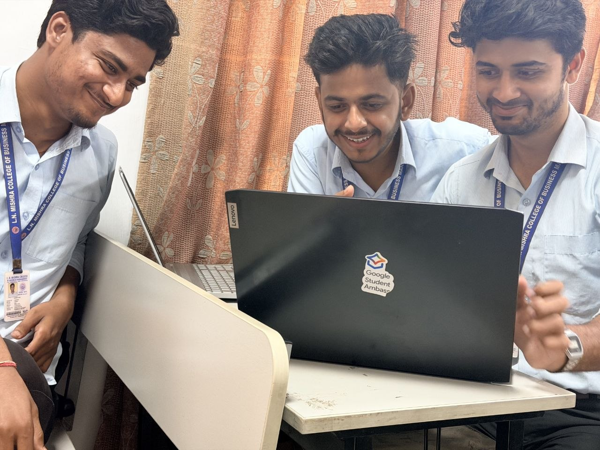
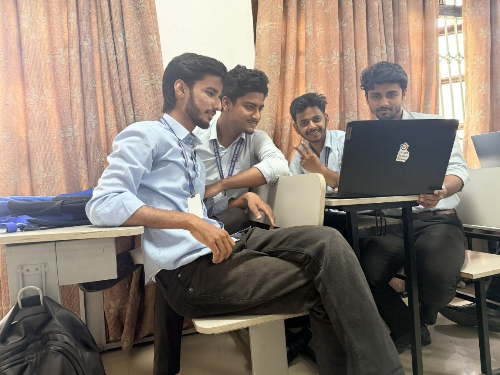
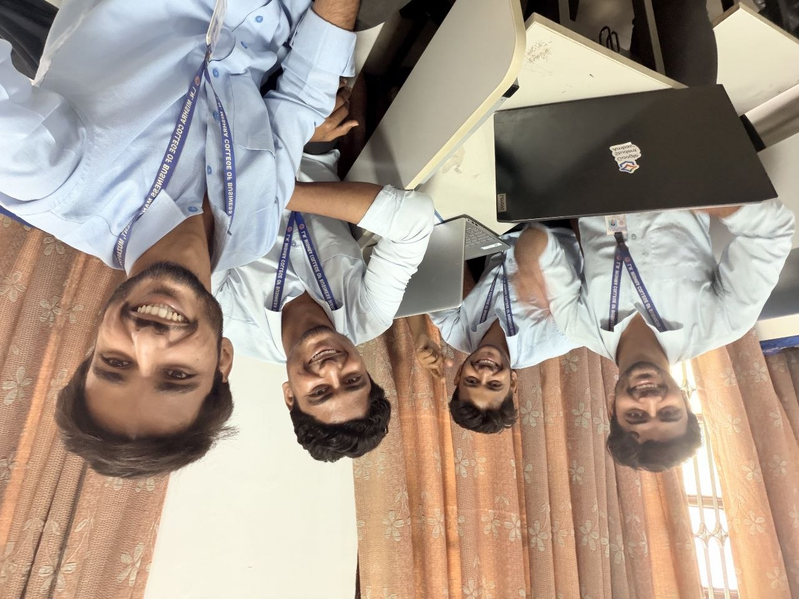

<h1 align="center">
  
  ConnectSphere
</h1>
<p align="center"><strong>The Ultimate Social Media Web Experience</strong></p>

<p align="center">
  
  
  
</p>

<p align="center">
  🪐 <b>BCA Final Year Capstone Project</b> • Driven by 💡 Knowledge, 🎉 Fun, 😄 Happiness, and 🚀 Endless Learning.
</p>

---

## 🚀 About ConnectSphere
**ConnectSphere** is a next-generation social networking platform engineered to bridge connections seamlessly. Built as our final year Bachelor of Computer Applications (BCA) capstone project, this application showcases modern full-stack development patterns. It combines the lightning-fast rendering of **React + Vite** with the robust enterprise architecture of **Django Rest Framework**, powered by **Supabase (PostgreSQL)** for real-time data synchronization.

### ✨ Key Pillars of Our Journey
* **📚 Deep Knowledge:** Translating our entire BCA academic foundation—from core database concepts and data structures to software engineering principles—into a living, real-world full-stack application.
* **🎉 Absolute Fun:** Turning complex architectural challenges into enjoyable coding sessions with the squad.
* **😄 Happiness:** Celebrating every successfully merged pull request, resolved conflict, and squashed bug together.
* **🚀 Continuous Learning:** Stepping out of our comfort zones to master state-of-the-art web technologies.

---

## 🛠️ The Tech Stack

<table>
  <tr>
    <td align="center" width="33%">
      <br/>
      <b>Frontend Ecosystem</b><br/>
      Vite, React, Modern UI/UX components
    </td>
    <td align="center" width="33%">
      <br/>
      <b>Backend Engine</b><br/>
      REST Framework, Core Logic, Authentication
    </td>
    <td align="center" width="33%">
      <br/>
      <b>Database & Cloud</b><br/>
      PostgreSQL, Realtime Subscriptions, Storage
    </td>
  </tr>
</table>

---

## 📖 Deep-Dive Documentation

For detailed step-by-step installation guides, internal architectures, and reference blueprints, navigate to the `./docs` directory:

```text
📁 docs/
├── 📂 API_DOC.md                  # REST Endpoint Specifications & Payload Schemas
├── 📂 BACK_FRONT_INTEGRATION.md    # Frontend-to-Backend State & Request Handling
├── 📂 BACKEND_SETUP.md             # Detailed Django & Supabase Local Provisioning
└── 📂 FRONTEND_SETUP.md            # Detailed Vite + React Environment Configs
```
---

## 👥 Meet The Squad (The Developers)
We are four classmates, builders, and dreamers turning lines of code into a living, breathing social ecosystem. Click on our badges below to explore our GitHub profiles:

<p align="center">
  <a href="https://github.com/harshraj152003">
    
  </a>
  &nbsp;&nbsp;
  <a href="https://github.com/Rishu00001">
    
  </a>
</p>

<p align="center">
  <a href="https://github.com/Shivam56291">
    
  </a>
  &nbsp;&nbsp;
  <a href="https://github.com/mdsharifsharry-max">
    
  </a>
</p>

---

## 📸 Classroom Hackathon Gallery
Candid highlights from our high-energy development session! This gallery features snapshots of our 4-member squad collaborating, code-sprinting, and brainstorming actively from our classroom desks.

<table align="center">
  <tr>
    <td align="center" width="25%">
      <br/>
      <sub><b>🧠 Deep Focus Session</b></sub>
    </td>
    <td align="center" width="25%">
      <br/>
      <sub><b>💬 Strategy & Brainstorming</b></sub>
    </td>
    <td align="center" width="25%">
      <br/>
      <sub><b>💻 Live Coding Marathon</b></sub>
    </td>
    <td align="center" width="25%">
      <br/>
      <sub><b>🔍 Collaborative Review</b></sub>
    </td>
  </tr>
  <tr>
    <td align="center" width="25%">
      <br/>
      <sub><b>⚡ Squashing Bugs Together</b></sub>
    </td>
    <td align="center" width="25%">
      <br/>
      <sub><b>📖 Learning & Implementing</b></sub>
    </td>
    <td align="center" width="25%">
      <br/>
      <sub><b>🎯 The Perfect Compile</b></sub>
    </td>
    <td align="center" width="25%">
      <br/>
      <sub><b>🎉 Team Spirit & Vibing</b></sub>
    </td>
  </tr>
</table>

---

☕ Help 4 tired developers celebrate their final year project
```
function evaluation(repo) {
    const isAwesome = true; 
    const hoursSpent = Infinity;

    if (isAwesome || hoursSpent > 100) {
        return "⭐ Click Star Button Above";
    } else {
        return "⭐ Click it anyway (it fixes a bug somewhere!)";
    }
}

console.log(evaluation(ConnectSphere));

```